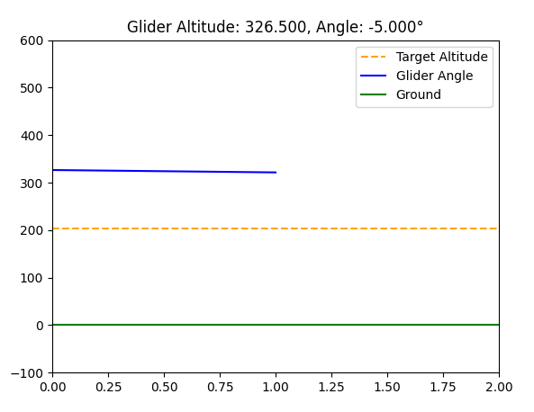

# WingSpan2024
The software end of Wentworth's Aerospace Engineering club 2024
### Glider PID Control and Visualization
This project simulates the glide path of an autonomous glider, adjusting its control surfaces based on altitude using a PID (Proportional-Integral-Derivative) controller. The glider's target is to land smoothly on a runway from a variable starting altitude and distance while maintaining proper glide slopes.

### Features
PID Control: Uses a simple PID loop to adjust the glider's pitch and angle based on altitude errors.
Dynamic Target: Randomized target altitude and starting altitude to simulate different scenarios.
Live Visualization: Real-time plot of the glider's altitude, angle, and landing path using matplotlib.
Configurable Parameters: Adjustable PID parameters, target altitude, and other constants for tuning.

### Project Structure
main.py: Main script that initializes the glider simulation, sets up PID control, and visualizes the flight path.
Core functionalities include:
- Altitude tracking
- Glide slope calculation
- Control surface adjustments via PID

### Dependencies
To run this project, you'll need the following Python libraries:
- bash
- pip install simple-pid matplotlib

### How It Works
1. Randomized Setup
The glider starts at a random altitude between 100m and 500m, with a random target altitude for landing.
Distance to the runway is fixed at 400 meters, and the control surface adjustments are based on the error in altitude, as calculated by the PID controller.
2. Glide Path Calculation
The glide slope is calculated based on the difference between the current altitude and the target altitude, relative to the distance to the runway.
The PID controller then adjusts the glider's angle to follow this slope for a smooth landing.
3. Live Visualization
The project uses matplotlib to show real-time changes in the glider's altitude and angle, with target altitude and ground levels clearly marked.

### Adjustable Constants
You can adjust the following constants for testing different scenarios:
TARGET_ALTITUDE: Set the target altitude for landing (0 for ground level).
RUNWAY_DISTANCE: Distance to the runway in meters.
KP, KI, KD: PID control constants (Proportional, Integral, and Derivative gains).
PID_OUTPUT_LIMITS: Limits for control surface adjustments (in degrees).

### Example
The simulation initializes with a randomized starting altitude and target altitude, then proceeds to visualize the glider's descent. The PID controller ensures that the glider adjusts its angle to achieve a smooth descent.

TARGET_ALTITUDE = randint(0, 500)  # Random target altitude
current_altitude = randint(100, 500)  # Random starting altitude

A live plot will display the glider's descent, updating in real-time.

### Future Improvements
Additional Sensors: Incorporate more realistic sensors for better simulation (GPS, IMU, etc.).
Wind Adjustments: Include wind speed and direction to further challenge the PID controller.
Advanced Visualization: Improve the visual representation of the glider's entire path and runway approach.

### License
This project is licensed under the MIT License.